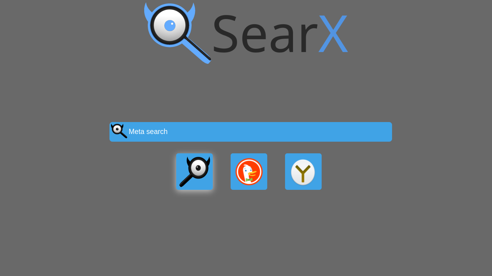
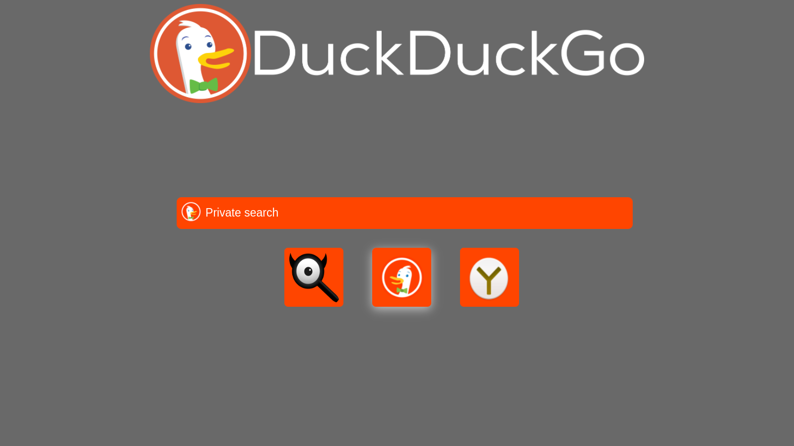
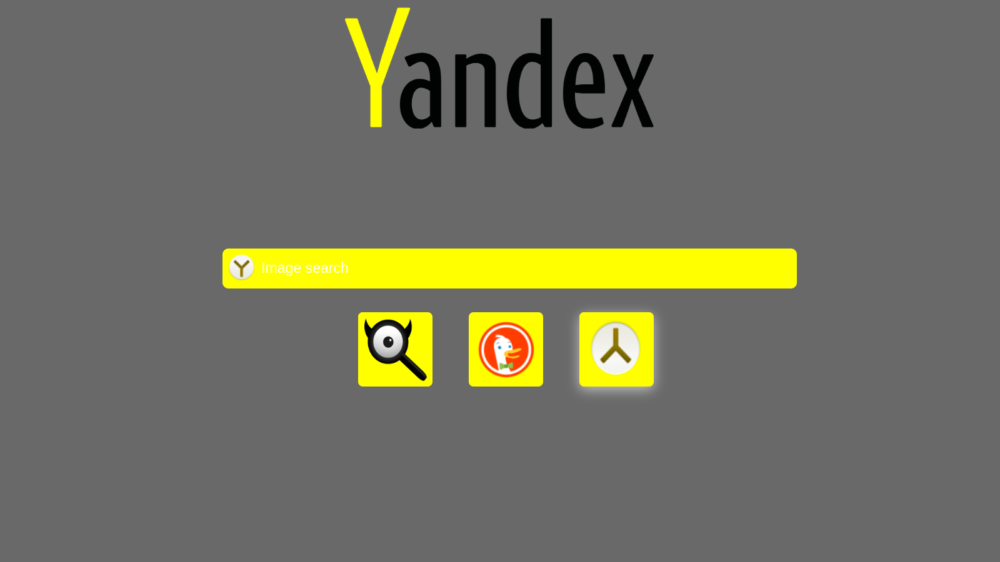

# custom-homepage

## what's this
simple custom homepage for chromium (or any browser really), because ungoogled chromium doesn't have any way I know of to customize homepage and new tabs.
## how to:
1. download the zip or clone the repo
2. extract the zip into a directory unlikely to change, or if cloned make sure it's cloned in a directory unlikely to change
3. 
 - if on chromium based browser:
	1. go to `chrome://flags/`
	2. look for the "Custom New Tab Page" flag
	3. enable, and set the path to your_directory/any_html.html, e.g: `/home/0x00Nu11/customHomepage/searx.html`
- if on gecko based browser:
	1. versions 41+ no longer support the browser.newtab.url setting in `about:config`, so you have to rely on an extension. I suggest [New Tab Override by Sören Hentzschel
](https://addons.mozilla.org/en-US/firefox/addon/new-tab-homepage/)
	2. set the new tab either to `about:home` or to your_directory/any_html.html, e.g: `/home/0x00Nu11/customHomepage/searx.html`
	3. go to `about:preferences#home` and set the homepage and new windows to your_directory/any_html.html, e.g: `/home/0x00Nu11/customHomepage/searx.html`